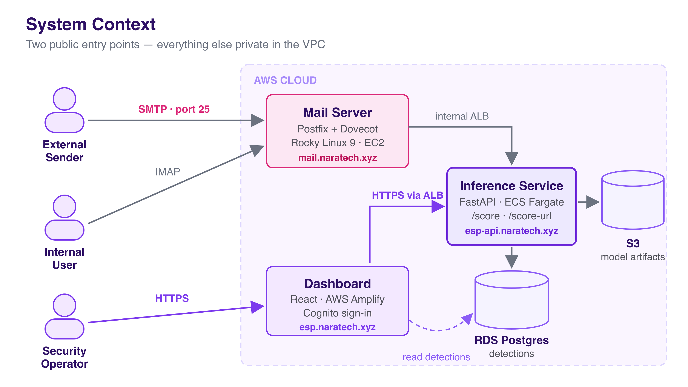

# Email Security Pipeline

> AI-powered phishing email and malicious URL classifier, running end-to-end on AWS.
> Two ways to score mail — an analyst dashboard and a live Postfix/Dovecot mail server — sharing one FastAPI inference service, with every piece provisioned by Terraform.

<div align="center">

[](https://www.python.org/) [](https://fastapi.tiangolo.com/) [](https://react.dev/) [](https://scikit-learn.org/) [](https://www.terraform.io/) <br/> [](https://aws.amazon.com/) [](https://www.postgresql.org/) [](https://www.docker.com/) [](LICENSE)
</div>

<div align="center">

[](https://github.com/naratech-eng/Email-Security-Pipeline/actions/workflows/terraform-apply.yml) [](https://github.com/naratech-eng/Email-Security-Pipeline/actions/workflows/sast.yml) <br/> [](https://github.com/naratech-eng/Email-Security-Pipeline/actions/workflows/dast-nightly.yml) [](https://sonarcloud.io/summary/new_code?id=naratech-eng_Email-Security-Pipeline)

</div>

<div align="center">

### 🔗 Live demo

**[esp.naratech.xyz](https://esp.naratech.xyz)** · API health: **[esp-api.naratech.xyz/health](https://esp-api.naratech.xyz/health)**

</div>

> [!IMPORTANT]
> **The live environment is scheduled to come down on 1 September 2026.**
> It runs on a personal AWS account at roughly **$36/week** at list price, which isn't worth keeping online indefinitely for a demo. After that date the links above stop resolving — everything else in this README still applies.
>
> The stack is fully reproducible: `terraform apply` from [`infra/envs/dev`](infra/envs/dev) rebuilds all 165 resources from scratch, and [`docs/runbook-destroy-rebuild.md`](docs/runbook-destroy-rebuild.md) documents the teardown and rebuild path.

---

## The problem

Phishing is still the most common entry point for serious security incidents. Most detection lives inside a mail provider you don't control, gives no explanation for its verdicts, and offers an analyst no way to interrogate a suspicious message after the fact.

This project builds the whole path instead — ingestion, feature extraction, classification, storage, and an analyst UI — so a verdict can be traced from raw `.eml` to the specific signals that produced it.

## What it does

| | |
|---|---|
| **Upload & detect** | Paste or upload an email in the dashboard, get a verdict, likelihood score, and a per-feature breakdown of why. |
| **Live mail scoring** | A self-hosted Postfix + Dovecot server on Rocky Linux 9 scores every inbound message through a Postfix `content_filter` before delivery. |
| **Shared inference** | Both paths hit the same FastAPI service on ECS Fargate — one model, one code path, no drift between demo and production behaviour. |
| **Detection history** | Every verdict is persisted to RDS PostgreSQL with its provenance, queryable from the dashboard. |

## Architecture



Two ingestion paths converge on a single inference service:

```
Analyst  ──►  Amplify (React SPA)  ──►  Public ALB  ──┐
                                                      ├──►  ECS Fargate (FastAPI)  ──►  RDS PostgreSQL
Internet ──►  EC2 Postfix/Dovecot  ──►  Internal ALB ─┘              │
              (content_filter)                                       └──►  S3 (model artifacts)
```

Design decisions worth calling out:

- **The mail server is EC2, not a container.** Postfix needs port 25 and persistent state; containerising it adds complexity for no practical gain. ([ADR-0004](docs/adr/0004-aws-deployment.md))
- **Outbound mail relays through SES.** AWS blocks outbound TCP/25 from EC2, and a fresh domain has no sending reputation — SES owns the IP reputation and DKIM-signs on the way out. ([`ses_relay`](infra/modules/ses_relay/main.tf))
- **No NAT gateway.** Five VPC interface endpoints cover ECR, Secrets Manager, CloudWatch Logs and Cognito at roughly NAT's price without the single point of egress.
- **The mail filter fails open.** A DNS hiccup or a scoring timeout must never bounce legitimate mail — persistence is a record-keeping nice-to-have, not a reason to fail the request the caller is waiting on.

Full detail in [Architecture](docs/architecture.md) and [Infrastructure](docs/infrastructure-terraform.md).

## Machine learning

Two independent tracks, selected after a comparison harness run across candidate models:

| Track | Model | F1 | Notes |
|---|---|---|---|
| Email | LinearSVC over TF-IDF + engineered features | ≈ 0.99 | Chosen for accuracy at near-zero inference cost |
| URL | Character-level CNN | ≈ 0.97 | Learns lexical patterns without hand-crafted rules |
| URL (fallback) | Random Forest | — | CPU-only path when the CNN is unavailable |

Feature engineering covers urgency signals, link counts, sender/reply-to mismatch, attachment shape, and authentication results (SPF/DKIM/DMARC) computed on the mail server itself — so a live message carries the same features the training corpus did.

See [Model Selection](docs/machine-learning.md) and [Model Comparison](docs/m5-t5-model-comparison.md).

## DevSecOps

Security controls run on every pull request rather than as an end-of-project audit:

| Stage | Controls |
|---|---|
| **Pre-commit** | gitleaks (blocks secrets before a commit exists), private-key detection, Terraform fmt |
| **SAST** | Semgrep, Bandit, CodeQL, SonarCloud quality gate |
| **Dependencies** | pip-audit, npm audit, Dependabot, Trivy image scanning |
| **IaC** | `terraform validate`, tfsec, Checkov (HIGH severity blocking) |
| **DAST** | ZAP active scan, Schemathesis API fuzzing, testssl.sh against ALB and mail server, swaks relay/spoof-rejection tests |
| **Runtime** | WAF on the public ALB, CloudTrail, AWS Config, GuardDuty-style alarming via SNS |

Promotion to the protected branch is gated on a clean nightly DAST run. Trade-offs that were accepted rather than solved are written down in [Security Decisions](docs/security-decisions.md) — including the ones that are still open.

See [DevSecOps](docs/devsecops.md) and [Threat Model](docs/threat-model.md).

## CI/CD workflows

Twelve GitHub Actions workflows. All AWS access is via **OIDC role assumption** — there are no long-lived AWS keys stored in GitHub.

<details>
<summary><b>Show all 12 workflows</b></summary>

### On every pull request — the merge gates

| Workflow | What it does |
|---|---|
| [`terraform-pr.yml`](.github/workflows/terraform-pr.yml) | `fmt` → `validate` → tfsec → Checkov, then a real `terraform plan` posted as a PR comment so the blast radius is visible before merge. Runs unconditionally rather than behind a `paths:` filter — a path-filtered trigger never runs at all on non-infra PRs, leaving required checks stuck "waiting" forever. A `changes` job decides whether to do real work instead. |
| [`sast.yml`](.github/workflows/sast.yml) | Eight jobs: actionlint, Bandit + pip-audit, npm audit + ESLint + Vitest, Semgrep, gitleaks, CodeQL, and an aggregating gate that fails if any blocking child failed. One red check instead of hunting through eight. |
| [`backend-tests.yml`](.github/workflows/backend-tests.yml) | pytest, scoped by path to `backend/**` and the shared feature-extraction module. |
| [`backend-image-scan.yml`](.github/workflows/backend-image-scan.yml) | Builds the container and Trivy-scans it *before* merge, so a vulnerable base image is caught while the change is still cheap to revert. |
| [`sonarcloud.yml`](.github/workflows/sonarcloud.yml) | Quality gate — maintainability and reliability treated as security properties, not cosmetics. |

### On merge to `dev` — continuous deployment

| Workflow | What it does |
|---|---|
| [`terraform-apply.yml`](.github/workflows/terraform-apply.yml) | Auto-applies any `infra/**` change. **Merging to `dev` changes live infrastructure** — worth knowing before you approve a PR. |
| [`backend-deploy.yml`](.github/workflows/backend-deploy.yml) | Build → Trivy scan → push to ECR → roll the ECS task definition. The scan sits *between* build and push, so a failing image never reaches the registry. |
| [`dast-baseline.yml`](.github/workflows/dast-baseline.yml) | Chained off `Backend Deploy` completing via `workflow_run`, so the ZAP baseline always hits the build that was just deployed rather than whatever happened to be live. |

### Nightly

| Workflow | What it does |
|---|---|
| [`dast-nightly.yml`](.github/workflows/dast-nightly.yml) | 08:00 UTC, five jobs against the running system: ZAP active scan, Schemathesis API fuzzing, testssl.sh against both the ALB and the mail server, swaks relay/spoof-rejection tests, and a gate that aggregates them. This is the job that catches things unit tests structurally cannot — it found anonymous TLS ciphers offered on SMTP submission, where an attacker positioned to MITM could have read SASL credentials. |

### Promotion and release

| Workflow | What it does |
|---|---|
| [`naratech-promotion-gate.yml`](.github/workflows/naratech-promotion-gate.yml) | Blocks promotion to `naratech` unless the most recent nightly DAST run passed. Deliberately reads the latest completed run on *any* branch: filtering to one branch returns zero runs, falls through to the "nothing to gate on" path, and silently passes — defeating the gate. |
| [`release.yml`](.github/workflows/release.yml) | Derives the next semver from Conventional Commit subjects since the last tag, then tags and publishes release notes. Docs/chore-only merges deliberately cut **no** release — otherwise a documentation tweak would mint a version whose notes say nothing happened. |

### Manual

| Workflow | What it does |
|---|---|
| [`zap-dashboard-auth.yml`](.github/workflows/zap-dashboard-auth.yml) | ZAP scan of the dashboard from *behind* Cognito authentication. Manual-only, because it needs a live session and will generate real detection records. |

</details>

## Tech stack

**Backend** : [FastAPI](https://fastapi.tiangolo.com/) · [Python 3.13](https://www.python.org/) · [scikit-learn](https://scikit-learn.org/) · [psycopg 3](https://www.psycopg.org/) · [Alembic](https://alembic.sqlalchemy.org/) <br/>
**Frontend** : [React 19](https://react.dev/) · [Vite 8](https://vitejs.dev/) · [Tailwind](https://tailwindcss.com/) · [AWS Amplify Hosting](https://aws.amazon.com/amplify/) <br/>
**Data** : [PostgreSQL 16](https://www.postgresql.org/) (RDS) · [S3](https://aws.amazon.com/s3/) (datasets, models, logs) <br/>
**Infra** : [Terraform 1.10](https://www.terraform.io/) · [ECS Fargate](https://aws.amazon.com/ecs/fargate/) · [ALB](https://aws.amazon.com/elasticloadbalancing/) · [Cognito](https://aws.amazon.com/cognito/) · [Route53](https://aws.amazon.com/route53/) · [ACM](https://aws.amazon.com/certificate-manager/) · [KMS](https://aws.amazon.com/kms/) · [Secrets Manager](https://aws.amazon.com/secrets-manager/) <br/>
**Mail** : [Postfix](http://www.postfix.org/) · [Dovecot](https://www.dovecot.org/) · [OpenDKIM](http://www.opendkim.org/) · [OpenDMARC](https://www.dmarc.org/) · [policyd-spf](http://www.policyd.org/) · [Amazon SES](https://aws.amazon.com/ses/) <br/>
**CI/CD** : [GitHub Actions](https://github.com/features/actions) with [OIDC](https://docs.github.com/en/actions/deployment/security-hardening-your-deployments/about-security-hardening-with-openid-connect) (no long-lived AWS keys)

## AWS services — and why each one

Everything below is provisioned by Terraform: **165 managed resources across 16 modules**, no console clicking. The interesting part isn't the list — it's why each service beat the alternative.

<details>
<summary><b>Show every AWS service and why it was chosen</b></summary>

### Compute

| Service | Role here | Why this |
|---|---|---|
| **ECS Fargate** | Runs the FastAPI inference service (0.5 vCPU / 1 GB) | The API is stateless and traffic is intermittent. Fargate means no EC2 fleet to patch or autoscale for something that idles most of the day. |
| **ECR** | Container registry, with a lifecycle policy ageing out old images | Keeps image pulls inside the VPC via endpoints. The lifecycle rule exists because untagged layers accumulate silently and are billed. |
| **EC2** (`t3.small`) | Postfix + Dovecot mail server on Rocky Linux 9 | Postfix needs port 25 and persistent mailbox state. Containerising it adds real complexity for no practical gain — see [ADR-0004](docs/adr/0004-aws-deployment.md). |
| **Elastic IP** | Static address for the mail server | Learned the hard way: an auto-assigned IP changes on every stop/start, which silently breaks inbound mail (MX → A no longer resolves to you) and leaves SPF's `a`/`mx` mechanisms authorising an address AWS has already given to someone else. |

### Networking

| Service | Role here | Why this |
|---|---|---|
| **VPC** | Custom `10.20.0.0/16`, public + private subnets across two AZs | Private subnets for the API and database; only the ALB and mail server are reachable from the internet. |
| **ALB** ×2 | Public (dashboard → API) and internal (mail server → API) | Splitting them means the mail filter's path to the API is never internet-reachable. The internal ALB costs ~$3.78/week for exactly that isolation. |
| **VPC endpoints** ×6 | ECR (api + dkr), CloudWatch Logs, Secrets Manager, Cognito, S3 gateway | Lets private subnets reach AWS APIs **without a NAT gateway**. Roughly the same price as NAT, but no single point of egress failure. |
| **Route 53** | Four delegated subdomain zones under `naratech.xyz` | The apex lives in a different account, so each subdomain is delegated rather than the whole domain being moved. |
| **ACM** | TLS certificates for the ALB and both Amplify domains | Auto-renewing and free; the alternative is remembering to rotate certs by hand. |

### Data

| Service | Role here | Why this |
|---|---|---|
| **RDS PostgreSQL 16** | Detection history with full provenance per verdict | The data is relational and the dashboard queries it by source, verdict and date. Managed snapshots and point-in-time restore matter more than the cost saving of self-hosting — a KMS outage once put this instance into an unrecoverable state, and only the automated snapshots brought it back. |
| **S3** ×6 | Datasets, model artifacts, application logs, avatars, boot scripts, security logs | Every bucket is versioned, SSE-encrypted, public access blocked, with lifecycle rules. Model artifacts live here rather than in the image so a retrain doesn't require a redeploy. |

### Identity & secrets

| Service | Role here | Why this |
|---|---|---|
| **Cognito** | User pool + identity pool + three role groups for the dashboard | Analyst RBAC without hand-rolling auth. Hand-rolled session handling is where this kind of project usually grows its worst vulnerability. |
| **Secrets Manager** ×3 | DB credentials, JWT signing key, SES SMTP credentials | Injected into the ECS task at runtime, so nothing sensitive is baked into an image or a Terraform variable file. |
| **KMS** | Customer-managed keys for S3, RDS and log encryption | Explicit key ownership and rotation rather than relying on AWS-managed defaults. |
| **IAM** | 8 roles + a GitHub OIDC provider | CI assumes a role via OIDC, so **there are no long-lived AWS access keys in GitHub at all** — the credential that can't leak is the one that doesn't exist. |

### Email delivery

| Service | Role here | Why this |
|---|---|---|
| **SES** | Outbound relay on :587, with Easy DKIM signing | AWS blocks outbound TCP/25 from EC2, and a new domain has no sending reputation — Gmail would reject us on both counts. SES owns the IP reputation and DKIM-signs on the way out, so mail still comes from our own domain. Inbound DKIM/DMARC verification stays on the mail server (OpenDKIM in verify-only mode). |

### Security & observability

| Service | Role here | Why this |
|---|---|---|
| **WAF v2** | Three rule groups on the public ALB, with logging | The dashboard and API are the only internet-facing surfaces; this is the cheapest layer in front of them. |
| **CloudTrail** | API audit trail into a dedicated security-logs bucket | Separate bucket so log retention and access are governed independently of application data. |
| **AWS Config** | Configuration recorder + delivery channel | Catches drift applied outside Terraform, which is exactly the change nobody remembers making. |
| **CloudWatch** | 4 log groups, 5 alarms, Container Insights | Alarms on ALB 5xx, p95 latency, RDS CPU and connections, and WAF blocks. |
| **SNS** | Alarm fan-out | One topic so alarm routing is changed in a single place. |
| **EventBridge Scheduler** | Nightly data-retention purge task | Enforces the retention policy in [Data Retention & Privacy](docs/data-retention-privacy.md) automatically, rather than as a documented intention. |

### Frontend hosting

| Service | Role here | Why this |
|---|---|---|
| **Amplify Hosting** | React SPA, two branches (`dev` / `naratech`) with custom domains | Git-driven builds and a live environment per branch, with no web server to run or patch. |

> **Running cost:** roughly **$36/week** at on-demand list price. The largest single line is the six VPC interface endpoints, which exist to avoid a NAT gateway — a near-wash on price, chosen for the architecture rather than the bill.

</details>

## Repository structure

```
├── backend/            FastAPI inference service
│   ├── main.py           API routes, auth, prediction endpoints
│   ├── inference.py      Model loading and scoring
│   ├── db.py             Detections persistence (fails open by design)
│   ├── mime_parser.py    .eml parsing and feature extraction
│   └── migrations/       Alembic schema migrations
├── frontend/           React SPA (analyst dashboard)
├── infra/
│   ├── envs/dev/         Root module for the dev environment
│   ├── modules/          16 modules: network, ecs_service, rds_postgres,
│   │                     ec2_mailserver, ses_relay, cognito, waf,
│   │                     security_baseline, github_oidc, …
│   └── bootstrap/        Remote state bucket + lock
├── notebooks/          Data cleaning, feature engineering, model selection
├── models/             Trained artifacts (LinearSVC, char-CNN, vocab)
├── docs/               Architecture, ADRs, threat model, runbooks
└── .github/workflows/  12 CI/CD and security workflows
```

## Documentation

**Product** — [PRD](docs/prd.md) · [MoSCoW Requirements](docs/requirements-moscow.md) · [Roadmap](docs/roadmap.md)

**Engineering** — [Architecture](docs/architecture.md) · [Infrastructure](docs/infrastructure-terraform.md) · [Test Plan](docs/test-plan.md) · [Destroy/Rebuild Runbook](docs/runbook-destroy-rebuild.md)

**Security** — [DevSecOps](docs/devsecops.md) · [Threat Model](docs/threat-model.md) · [Security Decisions](docs/security-decisions.md) · [Data Retention & Privacy](docs/data-retention-privacy.md)

**Machine Learning** — [Model Selection](docs/machine-learning.md) · [Model Comparison](docs/m5-t5-model-comparison.md) · [Deep-Learning Track](docs/m5-t7-t8-deep-learning.md) · [Feature Matrix](docs/data/feature-matrix.md)

**Decisions** — [ADR-0001 Record decisions](docs/adr/0001-record-architecture-decisions.md) · [ADR-0002 Stack](docs/adr/0002-stack-choices.md) · [ADR-0003 Models](docs/adr/0003-model-strategy.md) · [ADR-0004 AWS](docs/adr/0004-aws-deployment.md) · [ADR-0005 DevSecOps](docs/adr/0005-devsecops-pipeline.md)

## Contributing

### Setup

```bash
git clone https://github.com/naratech-eng/Email-Security-Pipeline.git
cd Email-Security-Pipeline
pip install pre-commit && pre-commit install
```

**Installing the hooks is not optional.** gitleaks runs before a commit is created — it is the only control that *prevents* a secret from reaching this public repository rather than reporting it afterwards. A credential pushed to a public repo must be treated as compromised and rotated, even if the commit is later removed.

```bash
# Backend
cd backend && pip install -r requirements.txt && uvicorn main:app --reload

# Frontend
cd frontend && npm install && npm run dev
```

### Branching

```
feature/* or dev-<name>  ──►  dev  ──►  naratech
```

- `dev` is the integration branch. **Open pull requests against `dev`.**
- `naratech` is protected and reached only by promoting `dev` — never by targeting it directly.
- Merging to `dev` auto-applies Terraform to the dev environment, so infra changes land live on merge.

### Before you open a PR

- Run `terraform fmt -recursive` if you touched `infra/`
- Terraform plans run from the `dev` branch — planning from a stale branch that predates a module produces a destructive plan
- Add an [ADR](docs/adr/) for any decision that would be hard to reconstruct from the diff
- If you accept a trade-off rather than fixing it, record it in [Security Decisions](docs/security-decisions.md) so the gap reads as a decision, not an oversight

### Commit style

Conventional Commits — `fix(rds):`, `feat(api):`, `chore(ci):`. Explain *why* in the body; the diff already shows what.

## Status

Actively developed. The system runs on AWS with the dashboard, inference API, and mail server all live — though the hosted environment is scheduled for teardown on **1 September 2026** for cost reasons (see the note at the top). The code and Terraform remain complete and redeployable after that.

Known trade-offs — including the CI role's broad permissions and compliance being treated as documentation rather than a build target — are tracked openly in [Security Decisions](docs/security-decisions.md).

## License

Released under the [MIT License](LICENSE) — free to use, modify and distribute, with attribution and no warranty.
