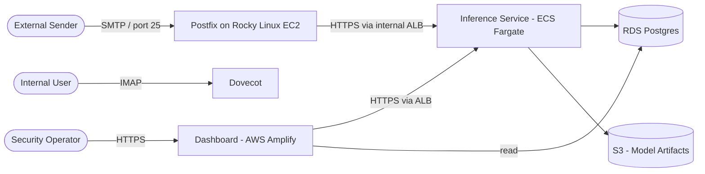
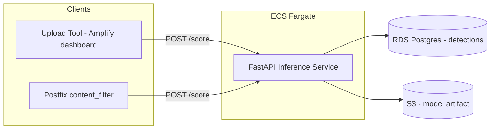
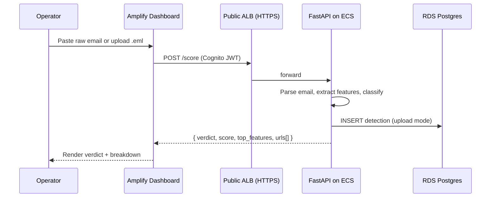
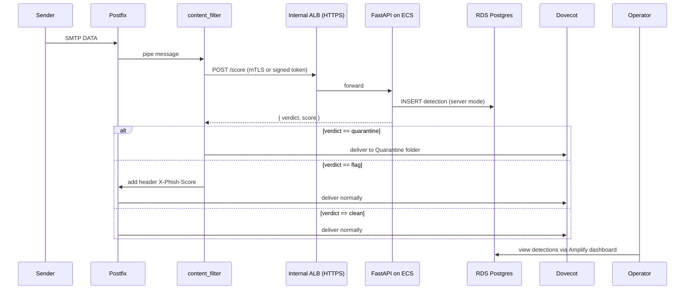
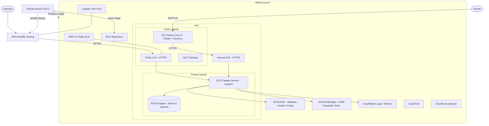
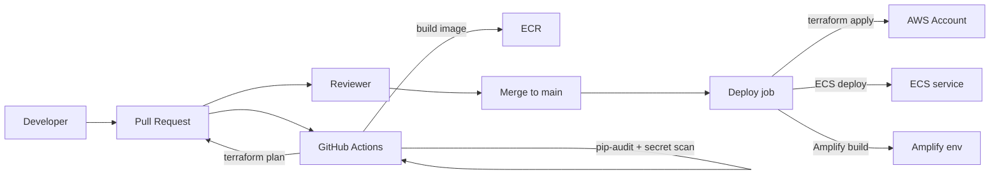

# Architecture

This document describes the architecture of the Email Security Pipeline, from system context down to deployment on AWS.

The system supports **two ways to score email**, sharing one backend:

1. **Upload & Detect (dashboard mode)** — operator pastes or uploads an email, gets an immediate verdict. Built first for fast iteration and a strong demo.
2. **Real-time mail flow (server mode)** — Postfix on a Rocky Linux EC2 instance hands every inbound email to the same scoring service before delivery to Dovecot.

Both clients hit the same FastAPI inference service and write detections to the same database, so the dashboard always shows results from both paths.

---

## 1. System Context

The system has two trust ingress points: the public mail server (port 25) and the operator dashboard (HTTPS via Amplify). Everything else is private inside the VPC.

---

## 2. Two Clients, One Backend

Key consequence: building the dashboard's upload feature **also** builds the integration the milter will use. Phase B (real-time) is mostly Postfix configuration and a small filter script, not new ML work.

---

## 3. Component View

| Component | AWS Service | Responsibility |
|---|---|---|
| **Frontend** | AWS Amplify Hosting | React dashboard: upload tool, flagged-email list, detail view, trends |
| **Backend API** | ECS Fargate behind ALB | FastAPI app exposing `/score`, `/score-url`, `/detections`, `/health` |
| **Container Registry** | ECR | Stores tagged FastAPI images, scanned by ECR image scanning + Trivy in CI |
| **Mail Server** | EC2 (Rocky Linux 9) | Postfix (SMTP) + Dovecot (IMAP) + content_filter that calls the inference ALB |
| **Database** | RDS PostgreSQL | Stores detections, audit log, dashboard data |
| **Object Storage** | S3 | Datasets, trained model artifacts, build artifacts |
| **Secrets** | AWS Secrets Manager + SSM Parameter Store | DB creds, JWT signing keys, third-party API keys |
| **Identity** | Amazon Cognito (user pool) | Operator auth for the dashboard |
| **Networking** | VPC, public + private subnets, NAT, ALB, security groups | Isolates ECS + RDS in private subnets; only EC2 mail and ALB are reachable from outside |
| **Edge** | CloudFront + AWS WAF (in front of ALB and Amplify) | Rate limiting, common rule set, geo controls |
| **Observability** | CloudWatch Logs + Metrics + Alarms, AWS X-Ray | Centralised logs, latency / error alarms |
| **Audit** | CloudTrail + Config | Track API and resource changes |
| **IaC** | Terraform | All infrastructure declared in code |

---

## 4. Data Flow — Upload & Detect (Phase A)

This is the **MVP demo path**. It works without any mail server.

---

## 5. Data Flow — Inbound Email (Phase B)

The dashboard now shows both upload-mode and server-mode detections in the same list, filterable by `source = upload | server`.

---

## 6. Feature Extraction

| Group | Examples |
|---|---|
| Header | SPF/DKIM/DMARC results, From/Reply-To mismatch, Received-chain length |
| Body | URL count, HTML/text ratio, urgency keywords, presence of forms, attachment count |
| URL | Length, dots, HTTPS vs HTTP, IP-based host, `@` in URL, suspicious TLDs, shortener match |
| Lexical | TF-IDF on body text |

Preprocessing is implemented in a single Python module imported by both training and the inference container, so train/serve features never drift.

---

## 7. Model Strategy

- **Baseline:** Random Forest on hand-crafted features. Fast, explainable, low resource cost.
- **Comparison:** Logistic Regression and SVM on the same features.
- **Stretch:** DistilBERT fine-tuned on email body, optionally combined with structured features (wide-and-deep).

The final model artifact is published to S3 and pulled by the ECS task on startup, so we can roll forward/back without rebuilding the container image.

See [ADR-0003: Model strategy](adr/0003-model-strategy.md).

---

## 8. API Surface (FastAPI on ECS)

| Endpoint | Method | Auth | Description |
|---|---|---|---|
| `/health` | GET | none | Liveness probe for ALB |
| `/score` | POST | Cognito JWT (dashboard) or signed token (milter) | Body: full email JSON. Returns `{verdict, score, top_features}` |
| `/score-url` | POST | same | Body: `{url}`. Returns `{verdict, score}` |
| `/detections` | GET | Cognito JWT | List flagged emails with filters |
| `/detections/{id}` | GET | Cognito JWT | Detail view |
| `/metrics` | GET | private only | Prometheus-compatible (optional) |

---

## 9. AWS Deployment View

### Deployment notes

- **VPC layout:** 2 AZs minimum, public subnets for the mail server and ALBs, private subnets for ECS and RDS, NAT for egress.
- **Mail server on EC2:** Rocky Linux 9 AMI (CentOS-compatible successor). Elastic IP for stable MX record. Outbound port 25 via Elastic IP only — request AWS to remove the default port 25 throttling if outbound is needed for testing.
- **ECS Fargate:** stateless, auto-scales on CPU + request count. Health check on `/health`. Task role has read-only access to the model bucket and read on Secrets Manager paths it needs.
- **RDS Postgres:** start with `db.t4g.micro`, single-AZ for cost, snapshot daily. Move to Multi-AZ for the demo if budget allows.
- **Amplify:** connected to the GitHub repo, branch-based environments (`main` → prod, PR previews enabled).
- **Public access:** the dashboard is the only publicly-reachable HTTP path besides the mail server's port 25.
- **Internal traffic:** ECS pulls images via VPC endpoints to ECR, secrets via VPC endpoint to Secrets Manager, no NAT cost for AWS API calls.

### OS choice

| Option | Verdict |
|---|---|
| **Rocky Linux 9** | Recommended. RHEL-compatible, official AWS Marketplace AMI, drop-in for CentOS workflow |
| **AlmaLinux 9** | Equally good alternative |
| **CentOS 9 Stream** | Acceptable but not in AWS Quick Start AMIs; uses community images |
| **Amazon Linux 2023** | Excellent for AWS-native workloads, but diverges slightly from the CentOS workflow promised in the brief |

---

## 10. DevSecOps Pipeline

DevSecOps is treated as a first-class deliverable, in line with the Milestone 4 guidance.

See [DevSecOps page](devsecops.md) for the full control list and pipeline stages.

---

## 11. Security Considerations

See the full [Threat Model](threat-model.md). High-level controls in the AWS topology:

- WAF + AWS-managed rule set in front of public ALB
- Cognito-issued JWTs required for all dashboard API calls
- Milter authenticates with mTLS or a signed short-lived token
- Security groups: ALB → ECS only on the API port; ECS → RDS only on 5432
- RDS encrypted at rest (KMS), TLS in transit
- S3 buckets: block public access, default encryption, versioning enabled, separate buckets for datasets, models, and Terraform state
- Secrets in AWS Secrets Manager, never in env files committed to the repo
- CloudTrail + Config enabled, GuardDuty optional
- Postfix on EC2 hardened: restricted relay, TLS, SPF/DKIM/DMARC validation as a feature

---

## 12. Observability

- **Logs:** ECS tasks → CloudWatch Logs in JSON, retention 30 days
- **Metrics:** CloudWatch metrics for inference latency, queue depth, 4xx/5xx rate, RDS CPU/connections
- **Tracing:** AWS X-Ray on FastAPI (optional)
- **Alarms:** PagerDuty/email on 5xx > 1% or latency p95 > 2s
- **Detection records:** every scoring call is recorded in RDS with `source` (`upload` | `server`), score, top features, and timestamp
- **Project tracking:** backlog and milestone tracking live in the [Notion workspace](https://www.notion.so/361ee3d2d2cf811890e3c6ea307645f3)

---

## 13. Scalability Notes

The capstone targets light load. The architecture scales linearly:
- ECS Fargate auto-scales on CPU/requests
- Move RDS to Multi-AZ + read replica for traffic spikes
- Cache URL scores in ElastiCache (Redis) if the same URLs repeat

---

## 14. Tech Stack Summary

| Layer | Choice |
|---|---|
| Cloud | AWS |
| Frontend hosting | AWS Amplify Hosting |
| Frontend framework | React + Vite (or Next.js) + Tailwind |
| Auth | Amazon Cognito (User Pool) |
| Backend runtime | ECS Fargate |
| Backend framework | FastAPI + Uvicorn (Python 3.11+) |
| Container registry | Amazon ECR |
| Mail server | Postfix + Dovecot on Rocky Linux 9 (EC2) |
| Database | Amazon RDS for PostgreSQL |
| Object storage | Amazon S3 |
| Secrets | AWS Secrets Manager + SSM Parameter Store |
| Networking | VPC, ALB, WAF, CloudFront (optional) |
| ML | scikit-learn (baseline), PyTorch + Hugging Face DistilBERT (stretch) |
| IaC | **Terraform** |
| CI/CD | GitHub Actions |
| Security scanning | tfsec, Checkov, Trivy, pip-audit, GitHub secret scanning, Dependabot |
| Observability | CloudWatch Logs/Metrics/Alarms, X-Ray (optional) |
| Audit | CloudTrail, AWS Config |
| Docs | GitBook (this site) |
| Project mgmt | [Notion workspace](https://www.notion.so/361ee3d2d2cf811890e3c6ea307645f3) + GitHub Issues |
