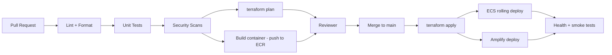

# DevSecOps

This page describes how security and reliability are baked into the SDLC for the Email Security Pipeline. It satisfies the DevSecOps expectation called out in `milestone-guide.md` (Milestone 4 onwards) and supports Milestones 8, 9, and 10.

## 1. Principles

- **Shift left.** Catch issues in PRs, not in production.
- **Everything in code.** Infra, app config, pipelines, policies are all in the repo.
- **Least privilege.** Every IAM role, every security group, every database user.
- **No long-lived secrets.** OIDC for CI; Secrets Manager for runtime.
- **Reproducible.** `terraform apply` from a clean account stands the system up.

## 2. Pipeline Overview

## 3. Required Checks (PR-blocking)

| Stage | Tool | Blocks merge if... |
|---|---|---|
| Lint | `ruff`, `black --check`, `eslint`, `prettier --check` | Style or basic issues |
| Tests | `pytest`, `vitest` | Any test fails |
| IaC scan | **tfsec**, **Checkov** | High-severity Terraform finding |
| Container scan | **Trivy** image scan + ECR scan | High CVE in image |
| Dep scan | **pip-audit**, **npm audit**, **Dependabot** | High CVE in deps |
| Secrets | **GitHub secret scanning** | Any leaked secret |
| Terraform plan | `terraform plan` | Plan errors |

### 3.1 IaC Scan Baseline

The Terraform passes **Checkov with 0 failures** and **tfsec with 0 HIGH/CRITICAL** findings. Most controls are enforced in code (KMS encryption on S3/ECR, IMDSv2 on EC2, locked-down default SG, RDS IAM auth + log exports + Performance Insights, ALB drop-invalid-headers, S3 abort-incomplete-upload lifecycle, etc.).

A small set of checks are **deliberately suppressed with inline `#checkov:skip=` justifications**, for three documented reasons:

| Reason | Examples |
|---|---|
| **Lab budget** — fix requires paid AWS features | RDS Multi-AZ, enhanced monitoring, dedicated KMS CMKs, detailed EC2 monitoring, VPC flow logs |
| **Conflicts with OPS-T1 rebuild** — would block `terraform destroy` | ALB & RDS deletion protection |
| **Intentional design** — not a real risk here | Internal ALB serves VPC-private HTTP, mail server needs a public IP, port 80 only does the HTTPS redirect, CI role is OIDC-gated AdministratorAccess |

Each suppression carries a one-line rationale at the resource in the Terraform, so reviewers (and graders) can see every decision was deliberate rather than overlooked. All are flagged to tighten before any production deployment.

## 4. Branching & Environments

| Branch | Environment | Notes |
|---|---|---|
| `feature/*` | none | CI checks run on PR; plan posted as PR comment |
| `dev` | dev | `terraform apply` runs automatically on merge |
| `naratech` | prod (demo) | manual approval gate before apply |
| tagged release `v*` | prod (demo) | alias for naratech-based releases |

Flow: `feature/… → dev → naratech`

Amplify handles preview environments per PR for the dashboard automatically.

## 5. Secrets & Identity

- **CI to AWS:** GitHub OIDC + IAM role (`role-to-assume`) with least-privilege per workflow.
- **App secrets:** AWS Secrets Manager (DB credentials, JWT signing key) and SSM Parameter Store (non-sensitive config).
- **No static AWS keys** anywhere in the repo or CI environment.
- **Local dev:** developers use AWS SSO + `aws-vault`, never static IAM users.

## 6. Runtime Security Controls

- ALB only on 443; HTTP redirects to HTTPS
- WAF managed rule sets enabled (CommonRuleSet, KnownBadInputs, IP reputation)
- Security groups: ALB → ECS → RDS, deny everything else
- VPC endpoints for ECR, S3, Secrets Manager, CloudWatch Logs
- RDS encrypted at rest (KMS) and TLS in transit
- S3: block public access account-wide, default encryption, versioning
- CloudTrail enabled in all regions, logs to a dedicated S3 bucket
- Optional: GuardDuty, AWS Config, Security Hub

## 7. Code Hygiene

- Conventional commits
- PR template: change summary, threat-model impact, rollback plan
- Required code review (≥ 1 approver) on `main`
- Branch protection: required checks, no force push, dismiss stale approvals

## 8. Backups & Disaster Recovery

- RDS automated backups (7 days)
- S3 model bucket has versioning and a 30-day lifecycle
- Terraform state in S3 with versioning + DynamoDB lock
- Runbook: full recovery is `terraform apply` + restore latest RDS snapshot + redeploy ECS task

## 9. Risk Register

Lives in [Notion workspace](https://www.notion.so/361ee3d2d2cf811890e3c6ea307645f3) (Issues & Blockers DB) and the [Threat Model](threat-model.md). Each high-severity item must have an owner and a target resolution date.

## 10. Compliance Posture

For the capstone we treat compliance as documentation. Production deployment of this system would also need to consider GDPR, PIPEDA, and any sector-specific email handling rules — captured in the threat model.
