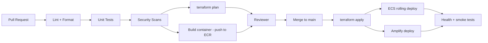

# DevSecOps

This page describes how security and reliability are baked into the SDLC for the Email Security Pipeline. It satisfies the DevSecOps expectation called out in `milestone-guide.md` (Milestone 4 onwards) and supports Milestones 8, 9, and 10.

## 1. Principles

- **Shift left.** Catch issues in PRs, not in production.
- **Everything in code.** Infra, app config, pipelines, policies are all in the repo.
- **Least privilege.** Every IAM role, every security group, every database user.
- **No long-lived secrets.** OIDC for CI; Secrets Manager for runtime.
- **Reproducible.** `terraform apply` from a clean account stands the system up.

## 2. Pipeline Overview



## 3. Required Checks (PR-blocking)

| Stage | Tool | Blocks merge if... |
|---|---|---|
| Lint | `ruff`, `black --check`, `eslint`, `prettier --check` | Style or basic issues |
| Tests | `pytest`, `vitest` | Any test fails |
| IaC scan | **tfsec**, **Checkov** | High-severity Terraform finding |
| Container scan | **Trivy** image scan + ECR scan | High CVE in image |
| Dep scan | **pip-audit**, **npm audit**, **Dependabot** | High CVE in deps |
| Secrets | **GitHub secret scanning** | Any leaked secret |
| Terraform plan | `terraform plan` | Plan errors |

### 3.1 IaC Scan Baseline

The Terraform passes **Checkov with 0 failures** and **tfsec with 0 HIGH/CRITICAL** findings. Most controls are enforced in code (KMS encryption on S3/ECR, IMDSv2 on EC2, locked-down default SG, RDS IAM auth + log exports + Performance Insights, ALB drop-invalid-headers, S3 abort-incomplete-upload lifecycle, etc.).

A small set of checks are **deliberately suppressed with inline `#checkov:skip=` justifications**, for three documented reasons:

| Reason | Examples |
|---|---|
| **Lab budget** — fix requires paid AWS features | RDS Multi-AZ, enhanced monitoring, dedicated KMS CMKs, detailed EC2 monitoring, VPC flow logs |
| **Conflicts with OPS-T1 rebuild** — would block `terraform destroy` | ALB & RDS deletion protection |
| **Intentional design** — not a real risk here | Internal ALB serves VPC-private HTTP, mail server needs a public IP, port 80 only does the HTTPS redirect, CI role is OIDC-gated AdministratorAccess |

Each suppression carries a one-line rationale at the resource in the Terraform, so reviewers (and graders) can see every decision was deliberate rather than overlooked. All are flagged to tighten before any production deployment.

### 3.2 Application Security Testing — SAST

Static Application Security Testing analyses our **own source code** (the IaC scans above only cover Terraform). SAST runs on every PR and is **shift-left / merge-blocking** on high-severity findings. Results are uploaded as **SARIF to the GitHub Security tab**.

| Target | Tool | Catches | Status |
|---|---|---|---|
| Python — API, `m6_inference.py`, extraction | **Bandit** + **Semgrep** (`p/python`, `p/owasp-top-ten`) | injection, unsafe deserialization, hardcoded secrets, `eval`/`subprocess` misuse | **implemented** — `sast.yml`, blocking |
| Python — deep dataflow | **CodeQL** (`python`) | taint-tracking vulns across functions | **implemented** — `sast.yml`, reported not blocking (see gate below) |
| React / TypeScript dashboard | **Semgrep** (`p/javascript`, `p/react`) + **eslint-plugin-security** | DOM-XSS sinks, `dangerouslySetInnerHTML`, prototype pollution | **implemented** — `sast.yml`, blocking |
| JS/TS — deep dataflow | **CodeQL** (`javascript-typescript`) | taint-tracking vulns across modules | **implemented** — `sast.yml`, reported not blocking |
| Secrets (full git history) | **gitleaks** | leaked keys/tokens beyond GitHub's native push-protection | **implemented** — `sast.yml`, blocking, `fetch-depth: 0` |
| Dependency CVEs | **pip-audit**, **npm audit** | known-vulnerable packages | **implemented** — `sast.yml`, blocking on HIGH |
| Workflow correctness | **actionlint** | invalid expression contexts that fail at run time with no usable log | **implemented** — `sast.yml`, blocking |
| Quality + security gate | **SonarCloud** (hosted SonarQube — free for public repos) | bugs, code smells, security hotspots, coverage + quality gate on PRs | **not implemented** — the one remaining item from this section's original intent |

**Gate:** any **HIGH/CRITICAL** finding from Bandit, Semgrep, gitleaks, eslint, pip-audit, or npm audit blocks the PR merge. Findings are triaged; accepted risks get an inline suppression with a one-line justification (same convention as the IaC baseline in §3.1).

**CodeQL is reported but not blocking, deliberately.** `security-extended` is a broad query set and this is its first run against the codebase — gating on it before anyone has triaged a baseline would block every PR on findings nobody has looked at yet, which is how a gate gets routed around instead of respected. Results still upload to the Security tab. Promote it to blocking once a baseline is triaged.

**Two calibration decisions in the frontend lint config** (`frontend/eslint.config.js`), both documented inline there:
- `security/detect-object-injection` runs at **warn**, not error: it fires on any `obj[key]` with a non-literal key — 17 hits here, all ordinary array indexing and `Record` lookups on internally-derived keys, none attacker-controlled. Erroring would demand 17 suppressions of non-issues and train everyone to add suppressions reflexively.
- `react-hooks/set-state-in-effect`, `purity`, and `refs` run at **warn**: they flag 9 genuine but pre-existing correctness issues (these rules are new in eslint-plugin-react-hooks v7). They're real technical debt worth fixing, but they aren't security findings, and erroring on them would have blocked every unrelated PR the moment this landed.

`dangerouslySetInnerHTML` is a hard **error** via `no-restricted-syntax` — the dashboard renders attacker-controlled content (an email's subject and sender come from whoever sent the mail), so that's the one sink genuinely worth failing a PR over. Verified by probe: the rule fires and exits non-zero on a test component that uses it.

**gitleaks allowlist:** one entry in `.gitleaks.toml` for AWS Route53 hosted zone IDs, which trip the entropy-based `generic-api-key` rule. They're public DNS identifiers, not credentials, and are already committed in plain sight as Terraform variable defaults. Scoped to the zone-ID shape rather than allowlisting the file — verified by probe that a real AWS key, GitHub PAT, or Slack token in the same file still fails the scan.

### 3.3 Application Security Testing — DAST

Dynamic Application Security Testing exercises the **running** service, so it runs **post-deploy** (against the dev/staging ECS service and the Amplify PR preview), plus a heavier nightly scan. DAST cannot run on a pure PR with no live target.

| Target | Tool | Stage | Scan type | Status |
|---|---|---|---|---|
| FastAPI inference API | **OWASP ZAP** | post-deploy (passive baseline) + nightly (full active) | spidering, injection, headers, auth | **implemented** — `dast-baseline.yml`, `dast-nightly.yml` |
| API contract / fuzzing | **Schemathesis** (from FastAPI OpenAPI schema) | nightly | property-based fuzzing of every endpoint | **implemented** — `dast-nightly.yml`, unauth + authenticated passes |
| Dashboard (Amplify preview) | **OWASP ZAP** (authenticated via Cognito token) | manual, on-demand | XSS, CSRF, security headers, auth bypass | **implemented, manual** — `zap-dashboard-auth.yml` (`workflow_dispatch` only). Cognito access tokens are short-lived (~1hr) and this repo deliberately does not store a real user's password as a CI secret, so this can't be scheduled: log into the dashboard, copy the access token from browser devtools, paste it in when triggering the workflow. Injects the token via ZAP's Replacer add-on (header on every request), not a full Selenium login flow — real coverage of what the API returns into the DOM (the actual XSS-relevant surface, since email subject/sender are attacker-controlled), but not a click-through of client-side route guards. |
| ALB TLS endpoint | **testssl.sh** | nightly | weak ciphers, protocol downgrade, cert issues | **implemented** — `dast-nightly.yml`'s `tls-scan` job, gates on HIGH/CRITICAL. Also scans the mail server's submission (587, STARTTLS) and IMAPS (993) listeners, not just the ALB. |
| Mail server (relay/spoof) | **swaks** scripts (test-plan SEC-01/02) | nightly | open relay, SPF/DKIM/DMARC bypass | **implemented** — `dast-nightly.yml`'s `mail-relay-test` job, automates the manual matrix from `docs/m7-t4-t6-mail-filter-testing.md` §4: unauthenticated relay on :25 must be rejected, unauthenticated submission on :587 must be rejected, authenticated submission on :587 must succeed, and the resulting inbound message must carry `Received-SPF`/`Authentication-Results` (verifies M9-T0 end-to-end, not just at the Terraform level) and `X-Phishing-Verdict`. |

**Gate:** the passive ZAP baseline runs post-deploy (informational, `fail_action: false`); a **HIGH** finding from the nightly full scan, Schemathesis, the TLS scan, or the mail relay tests fails `dast-nightly.yml`, which `naratech-promotion-gate.yml` reads as a required check on any PR targeting `naratech`. The authenticated dashboard scan is informational only (manual trigger, not part of the nightly gate). Fail-open behaviour (S-07) is itself a DAST scenario: ZAP/Schemathesis hammering the API must never block mail flow.

**Known trade-off, accepted deliberately (§4.1 — shared backend):** Schemathesis fuzzes `/analyze/email` with generated bodies against the one real `detections` table shared by dev and the naratech-promoted frontend. `submitted_by` is a client-supplied field, not derived from the auth token, so fuzzer-generated rows aren't reliably queryable by identity. Bounded via `--max-examples` and scheduled at low-traffic hours; review/clear obviously-fuzzed rows before a demo.

**Remaining gap from §3.2:** SonarCloud. Semgrep, CodeQL, gitleaks, and eslint-plugin-security all landed with SEC-SAST; SonarCloud is the one item from that section's original intent still outstanding.

### 3.4 Where each control runs

```
PR opened ──► SAST      (Bandit, Semgrep, eslint+security, actionlint)   [BLOCKS MERGE, sast.yml]
          ├─► Deps      (pip-audit, npm audit)                            [BLOCKS MERGE, sast.yml]
          ├─► Secrets   (gitleaks, full git history)                      [BLOCKS MERGE, sast.yml]
          ├─► CodeQL    (python, javascript-typescript)                   [reports to Security tab, not blocking yet]
          └─► IaC       (Checkov, tfsec)                                  [BLOCKS MERGE, terraform-pr.yml]
merge to dev ──► terraform apply + ECS deploy ──► DAST passive (ZAP baseline, dast-baseline.yml)
nightly ──────► DAST full (ZAP active, Schemathesis fuzz, testssl.sh,
                           swaks relay/spoof tests)                       [dast-nightly.yml]
on demand ────► authenticated dashboard scan (ZAP + Cognito token)        [zap-dashboard-auth.yml]
daily 07:00 ──► detection retention purge (180d)                          [ECS scheduled task, M9-T7]
PR targeting naratech ──► naratech-promotion-gate.yml reads the latest
                          nightly conclusion; fails the PR if it wasn't green
```

## 4. Branching & Environments

| Branch | Environment | Notes |
|---|---|---|
| `feature/*` | none | per-feature branches; CI checks run on PR; plan posted as PR comment |
| `dev-<name>` | none | personal working branches (`dev-nara`, `dev-michael`, …); same PR checks apply |
| `dev` | dev | `terraform apply` + backend ECS deploy run automatically on merge |
| `naratech` | prod (demo) | main branch; frontend-only promotion — see below |
| tagged release `v*` | prod (demo) | git tag created manually after a naratech merge (§4.2) |

Flow: `feature/… / dev-<name> → dev → naratech`

Amplify handles preview environments per PR for the dashboard automatically.

### 4.1 What "promoting to naratech" actually does

There is **one shared backend environment**, not a separate prod stack: one
ECS cluster, one RDS instance, one mail server, one Cognito pool
(`infra/envs/dev` is the only Terraform environment that exists). Neither
`terraform-apply.yml` nor `backend-deploy.yml` trigger on `naratech` — only
`dev`. A merge to `naratech` triggers exactly one thing: an Amplify build of
the frontend to `esp.naratech.xyz`, pointed at the same API, database, and
Cognito pool that `esp-dev.naratech.xyz` already uses.

So "prod" here means "the stable, demo-facing frontend build," not an
isolated environment. The manual approval gate this implies — no open HIGH
DAST finding — is enforced as a required PR check
(`naratech-promotion-gate.yml`) that reads the conclusion of the most recent
`dast-nightly.yml` run rather than re-running DAST on the PR itself (too slow
for a PR check, and DAST needs a live target that doesn't exist per-PR).

A genuinely separate prod backend (its own ECS/RDS/mail server/Cognito pool)
was considered and deliberately deferred — real infra cost roughly doubles,
and a second mail server means a second DNS/SES/cert setup. Worth revisiting
past the capstone if this becomes a real deployment.

### 4.2 Creating a release

After merging a PR into `naratech`:

```bash
git checkout naratech && git pull
git tag -a v1.1.0 -m "v1.1.0"
git push origin v1.1.0
gh release create v1.1.0 --title "v1.1.0" --generate-notes
```

Version numbers are chosen and applied manually — no automated
semantic-release. Bump the minor version for a feature merge, the patch
version for a fix-only merge, matching conventional-commit intent even though
nothing enforces it automatically.

## 5. Secrets & Identity

- **CI to AWS:** GitHub OIDC + IAM role (`role-to-assume`) with least-privilege per workflow.
- **App secrets:** AWS Secrets Manager (DB credentials, JWT signing key) and SSM Parameter Store (non-sensitive config).
- **No static AWS keys** anywhere in the repo or CI environment.
- **Local dev:** developers use AWS SSO + `aws-vault`, never static IAM users.

## 6. Runtime Security Controls

- ALB only on 443; HTTP redirects to HTTPS
- WAF managed rule sets on the public ALB (CommonRuleSet, KnownBadInputs incl. Log4Shell, Amazon IP reputation list). Starts in COUNT mode (`waf_block_mode = false`) until a baseline run against real traffic confirms no false positives.
- Security groups: ALB → ECS → RDS, deny everything else
- VPC endpoints for ECR, S3, Secrets Manager, CloudWatch Logs
- RDS encrypted at rest (KMS) and TLS in transit
- S3: block public access account-wide, default encryption, versioning
- CloudTrail enabled multi-region, dual delivery to a dedicated S3 bucket and CloudWatch Logs; AWS Config recorder + delivery channel also live
- CloudWatch alarms on the two things that predict an outage before it happens: ALB 5xx rate + p95 latency, RDS CPU + connection count — all fanned into one SNS topic (`monitoring` module)
- **GuardDuty and Security Hub are NOT enabled — a confirmed, permanent account-level limitation, not a gap in the Terraform.** `aws guardduty create-detector --enable` and `aws securityhub enable-security-hub` both 403 with `SubscriptionRequiredException` when run directly against this account (`lab-user`, the $200 school-credit account) with `AdministratorAccess` credentials — ruling out an IAM or CI-role issue. Education/credit AWS accounts commonly block usage-priced services like these to cap surprise billing. The Terraform (`infra/modules/security_baseline`) is written and ready — `enable_guardduty`/`enable_security_hub` just default to `false` — and would take effect immediately on a commercial-tier account.

## 7. Code Hygiene

- Conventional commits
- PR template: change summary, threat-model impact, rollback plan
- Required code review (≥ 1 approver) on `main`
- Branch protection: required checks, no force push, dismiss stale approvals

## 8. Backups & Disaster Recovery

- RDS automated backups (7 days)
- S3 model bucket has versioning and a 30-day lifecycle
- Terraform state in S3 with versioning + DynamoDB lock
- Runbook: full recovery is `terraform apply` + restore latest RDS snapshot + redeploy ECS task

## 9. Risk Register

Lives in [Notion workspace](https://www.notion.so/361ee3d2d2cf811890e3c6ea307645f3) (Issues & Blockers DB) and the [Threat Model](threat-model.md). Each high-severity item must have an owner and a target resolution date.

## 10. Compliance Posture

For the capstone we treat compliance as documentation. Production deployment of this system would also need to consider GDPR, PIPEDA, and any sector-specific email handling rules — captured in the threat model.
