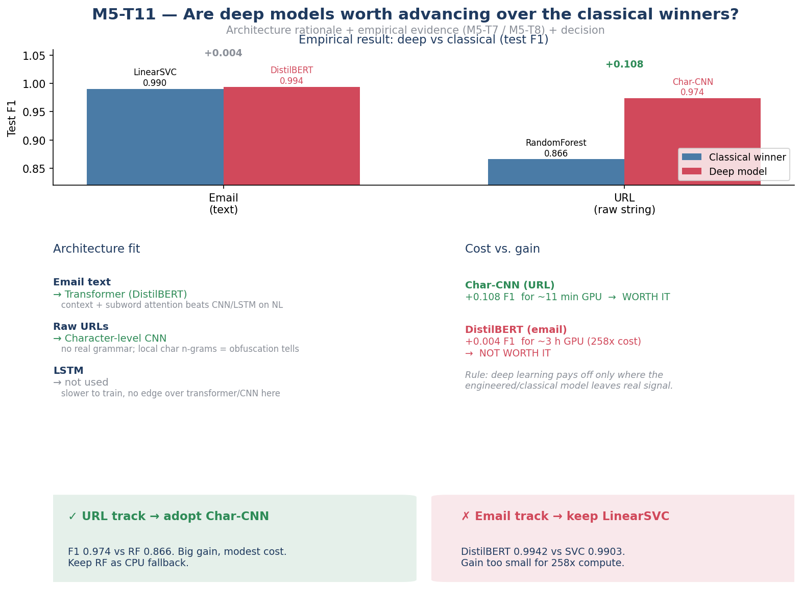
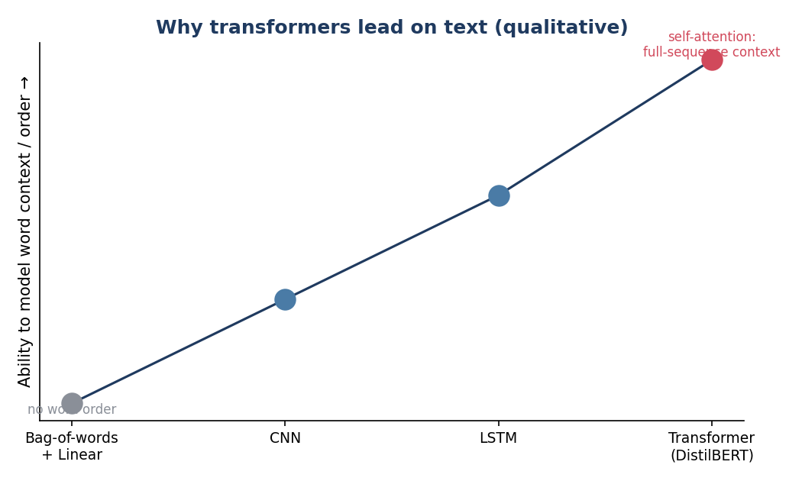

# M5-T11: Deep-Learning Research — Are Deep Models Worth Advancing? (Sanjeewa Narayana)

**Role:** ML Engineer (background research) | **Priority:** Low | **Feeds:** M5-T7 (DistilBERT), M5-T8 (char-CNN)
**Dependency:** none — independent research.

> Short, evidence-based justification of the deep-learning stretch choices for the M5 report,
> backed by the empirical M5-T7 / M5-T8 results.

## Rationale (the one paragraph)

Two deep architectures were chosen to match the nature of each input. For **email**, the text is
natural language, where **transformers** dominate: self-attention models full-sequence context and
sub-word meaning that bag-of-words/TF-IDF and even CNN/LSTM cannot, so a fine-tuned **DistilBERT**
(a distilled, cheaper BERT) is the right deep candidate [1][2]. For **URLs**, the input is a short,
adversarial *character* string with no real grammar, so a sequence transformer is overkill; a
**character-level CNN** is the established fit — it learns local character n-gram patterns
(odd tokens, encodings, look-alike domains) directly from the raw URL [3]. LSTMs were ruled out:
they train slower and offer no accuracy edge over a transformer (text) or a CNN (URLs) on this data.
Crucially, a deep model is only **worth advancing** when it beats the classical winner by enough to
justify its compute and deployment cost — and our results split cleanly on exactly that test
(see infographic): the **char-CNN is worth it** (URL F1 0.974 vs Random Forest 0.866, +0.108 for
~11 min GPU), while **DistilBERT is not** (email F1 0.9942 vs LinearSVC 0.9903, a +0.004 gain at
~258× the training cost). The lesson: deep learning pays off where the engineered/classical model
leaves real signal on the table (raw URL strings), and not where a cheap linear model already
saturates the task (TF-IDF email text).

## Figures

**Figure 1. Decision rationale infographic** — architecture fit + empirical gains + the two verdicts.

**Figure 2. Why transformers lead on text** (qualitative architecture ladder).

## References

1. Vaswani, A., et al. (2017). *Attention Is All You Need.* NeurIPS. — introduces the transformer
   self-attention mechanism that underpins BERT/DistilBERT.
2. Sanh, V., Debut, L., Chaumond, J., & Wolf, T. (2019). *DistilBERT, a distilled version of BERT:
   smaller, faster, cheaper and lighter.* — the model fine-tuned in M5-T7.
3. Le, H., Pham, Q., Sahoo, D., & Hoi, S. C. H. (2018). *URLNet: Learning a URL Representation with
   Deep Learning for Malicious URL Detection.* — character-level CNN for raw URLs, the basis for M5-T8.

## Decision output

- **Char-CNN (URL): advance to M6** — large, cost-justified accuracy gain over the engineered-feature model.
- **DistilBERT (email): do not advance** — keep LinearSVC; the transformer's gain is real but far too
  small to justify the compute and heavier inference.
