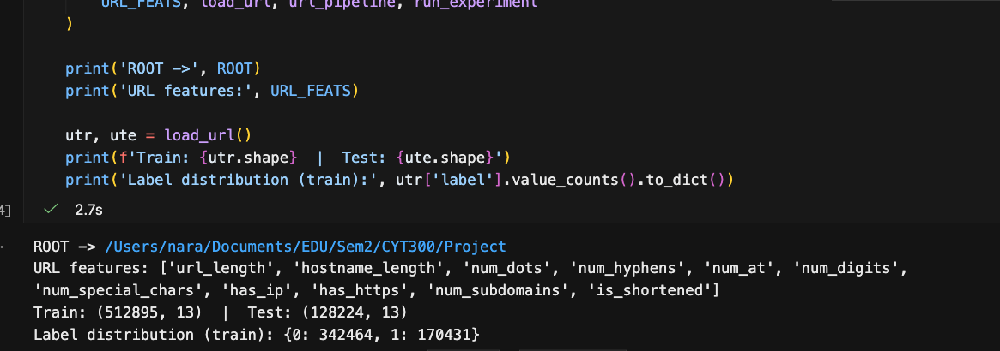
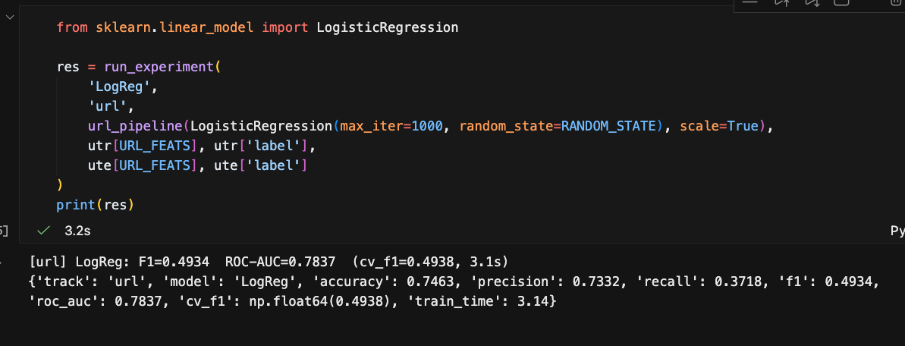
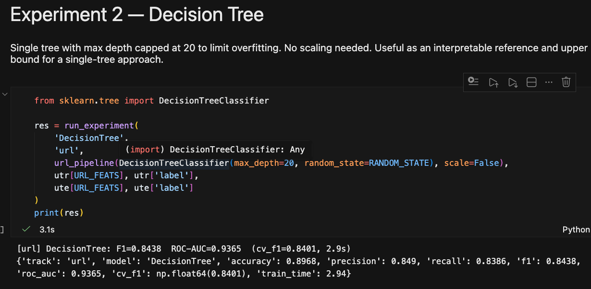
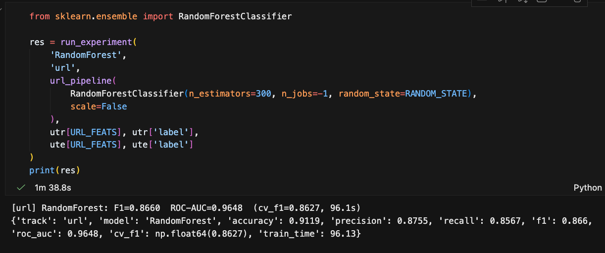
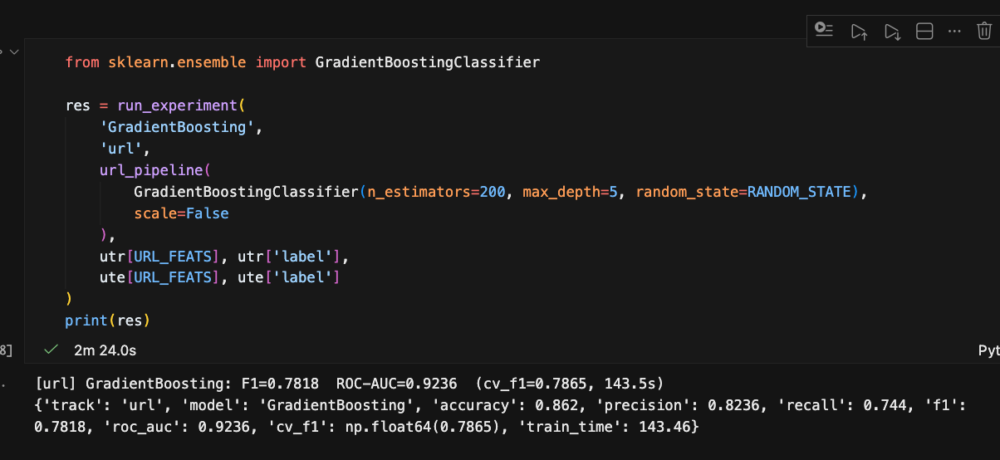
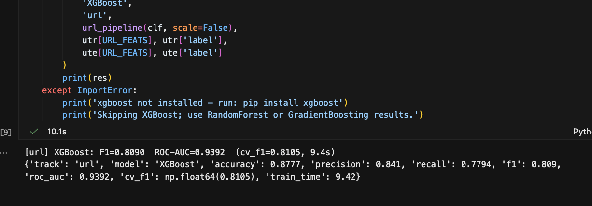
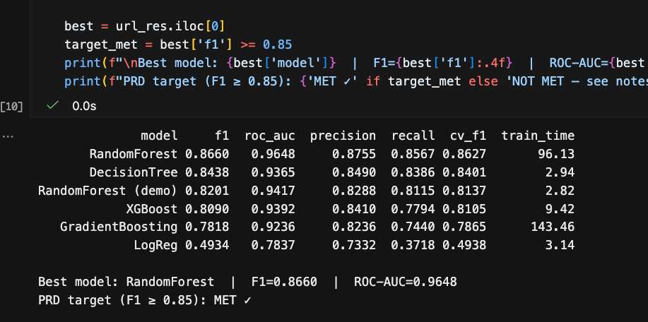
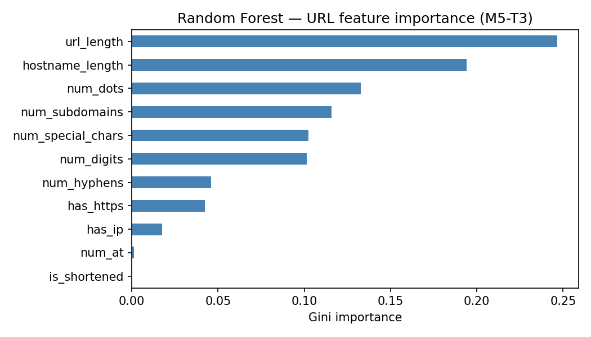

# M5-T3: URL Classifier — Model Selection Experiments (Klara)

**Role:** URL track | **Depends on:** M5-T1 (shared harness), M4-T3 / M4-T7 (URL features + splits)

> Figures are embedded from `Image/M5-T3/`. If pasting into Google Docs, drop the matching
> screenshot in place of each image.

## Objective
M5-T3 selects the best classifier for the **URL track** — scoring URLs found inside emails as
benign (0) or malicious (1) from 11 numerical structural features. Five candidates are
benchmarked through the M5-T1 harness, so every result uses the same 5-fold stratified CV, the
same fixed split, and the same metric set, and is directly comparable to the email track (T2).

**Dataset:** 512,895 train / 128,224 test URLs (label split 342,464 benign : 170,431 malicious).
**Acceptance target:** the URL classifier must reach an **F1 score of at least 0.85** on the
held-out test split (the portion of data the model never sees during training) to be accepted.
This bar was agreed at the start of the project as the minimum quality needed before the model
can be used in the pipeline.

---

## 1. Loading the shared harness
The notebook imports the harness as a module rather than re-running it, so the demo training
cells never fire and `m5_results.csv` is not disturbed.

```python
from m5_harness import (ROOT, RESULTS, RANDOM_STATE, CV,
                        URL_FEATS, load_url, url_pipeline, run_experiment)

utr, ute = load_url()        # 512,895 train / 128,224 test
```

`URL_FEATS` (11 numeric): `url_length`, `hostname_length`, `num_dots`, `num_hyphens`,
`num_at`, `num_digits`, `num_special_chars`, `has_ip`, `has_https`, `num_subdomains`,
`is_shortened`.

**Figure 1. Harness loaded + split shapes**



---

## 2. The five candidates
Each model is wrapped by `url_pipeline(...)`. Linear models are scaled; tree ensembles pass
`scale=False` because they don't need it.

```python
run_experiment('LogReg',           'url', url_pipeline(LogisticRegression(max_iter=1000), scale=True),  ...)
run_experiment('DecisionTree',     'url', url_pipeline(DecisionTreeClassifier(max_depth=20), scale=False), ...)
run_experiment('RandomForest',     'url', url_pipeline(RandomForestClassifier(n_estimators=300), scale=False), ...)
run_experiment('GradientBoosting', 'url', url_pipeline(GradientBoostingClassifier(n_estimators=200), scale=False), ...)
run_experiment('XGBoost',          'url', url_pipeline(XGBClassifier(n_estimators=300), scale=False), ...)
```

| # | Model | Why it's a candidate |
| --- | --- | --- |
| 1 | Logistic Regression | Linear baseline — sets the floor |
| 2 | Decision Tree | Interpretable single-tree reference |
| 3 | Random Forest | Standard strong baseline for tabular features |
| 4 | Gradient Boosting (sklearn) | Boosting baseline, no extra dependency |
| 5 | XGBoost | Fast gradient boosting, often state-of-the-art on tabular data |

Each experiment prints its metric row and auto-logs to `results/m5_results.csv`.

**Figure 2. Experiment 1 — Logistic Regression** (F1 = 0.4934)



**Figure 3. Experiment 2 — Decision Tree** (F1 = 0.8438)



**Figure 4. Experiment 3 — Random Forest** (F1 = 0.8660)



**Figure 5. Experiment 4 — Gradient Boosting** (F1 = 0.7818)



**Figure 6. Experiment 5 — XGBoost** (F1 = 0.8090)



---

## 3. Results
Ranked by test F1 (the primary metric). All numbers are on the held-out test split.

| Model | F1 | ROC-AUC | Precision | Recall | CV-F1 | Train time (s) |
| --- | --- | --- | --- | --- | --- | --- |
| **Random Forest** | **0.8660** | **0.9648** | 0.8755 | 0.8567 | 0.8627 | 96.1 |
| Decision Tree | 0.8438 | 0.9365 | 0.8490 | 0.8386 | 0.8401 | 2.9 |
| XGBoost | 0.8090 | 0.9392 | 0.8410 | 0.7794 | 0.8105 | 9.4 |
| Gradient Boosting | 0.7818 | 0.9236 | 0.8236 | 0.7440 | 0.7865 | 143.5 |
| Logistic Regression | 0.4934 | 0.7837 | 0.7332 | 0.3718 | 0.4938 | 3.1 |

**Figure 7. URL model comparison table + target check**



**Reading the table:**
- **Random Forest is the only model that clears the acceptance target (F1 ≥ 0.85).** It also leads on
  ROC-AUC (0.9648) and balances precision (0.88) and recall (0.86) — important because both
  false positives (blocking good links) and false negatives (missed phishing) carry cost.
- **CV-F1 ≈ test-F1 for every model** (RF: 0.8627 vs 0.8660), confirming no overfitting — the
  scores generalise to unseen URLs.
- **Logistic Regression collapses** (F1 = 0.49): a linear boundary can't separate these
  features, confirming the problem is genuinely non-linear and justifies tree-based models.

---

## 4. Is XGBoost the right choice here? → No.
XGBoost is often the default winner on tabular data, so it was tested directly. At default
settings it reached **F1 = 0.809 — below Random Forest (0.866) and even below a single Decision
Tree (0.844)**, and it does not meet the acceptance target. Its only advantage is speed (9 s vs RF's
96 s). XGBoost could likely be tuned to close the gap (deeper trees, more estimators,
learning-rate search), but that is out of scope for M5 selection: **Random Forest already meets
the target out of the box**, so it is the chosen model. XGBoost is noted as a tuning candidate
for M6/M8 if faster inference is later required.

---

## 5. Feature importance
Random Forest Gini importances confirm the model relies on sensible, explainable signals.

**Figure 8. Random Forest — URL feature importance**



The decision is driven by **URL/hostname length, the number of dots, and subdomain count** —
classic obfuscation tells (long, dotted, deeply-nested hostnames). `num_at` and `is_shortened`
contribute almost nothing on this corpus, but are kept for completeness and future datasets.

---

## Conclusion
- **Recommended model for M5/M6: Random Forest** — test **F1 = 0.866**, **ROC-AUC = 0.965**, the
  only candidate meeting the acceptance target of F1 ≥ 0.85.
- **XGBoost: not selected** — underperformed RF (F1 = 0.809) at default settings; retained as a
  speed-oriented tuning option for later.
- **No overfitting** — CV-F1 tracks test-F1 across all models.
- **Explainable** — top features (`url_length`, `hostname_length`, `num_dots`) are intuitive
  phishing indicators.
- **Handoff:** all five rows are logged to `results/m5_results.csv` (`track = url`), feeding
  M5-T4 (consolidation) and M5-T5 (final model comparison + selection).

---

## Appendix — What the metrics mean

Every URL is judged as **benign (0)** or **malicious (1)**. After predicting, we compare
predictions to the true labels. Four outcomes are possible:

- **TP** (true positive) — correctly caught a malicious URL
- **TN** (true negative) — correctly passed a benign URL
- **FP** (false positive) — false alarm, flagged a benign URL
- **FN** (false negative) — a miss, let a malicious URL through

Every metric below is built from these four counts.

| Metric | Plain-English meaning | Formula | Why it matters here |
| --- | --- | --- | --- |
| Accuracy | Of all URLs, what fraction did we label correctly? | (TP + TN) / all | Misleading on imbalanced data — 67% of URLs are benign, so a lazy "always benign" model already scores ~67%. |
| Precision | Of the URLs we flagged malicious, how many really were? | TP / (TP + FP) | High precision = few false alarms (we don't block good links). |
| Recall | Of all truly malicious URLs, how many did we catch? | TP / (TP + FN) | High recall = few misses (we don't let phishing through). |
| **F1** | The balance of precision and recall in one number (harmonic mean). | 2·P·R / (P + R) | **Primary metric.** Only high when *both* precision and recall are high, so it can't be gamed by ignoring one error type. |
| ROC-AUC | How well the model *ranks* malicious above benign across all thresholds (1.0 = perfect, 0.5 = random). | area under ROC curve | Threshold-independent quality check — shows separability before a cut-off is chosen. |
| CV-F1 | Mean F1 across the 5 cross-validation folds on the training data. | avg of 5 fold F1s | CV-F1 ≈ test-F1 → generalises (no overfitting); CV-F1 ≫ test-F1 → memorised the train set. |

**Worked example (Random Forest):** F1 = 0.866 with precision = 0.876 and recall = 0.857 means
that when it flags a URL as malicious it is right ~88% of the time, and it catches ~86% of all
malicious URLs — a strong, balanced result. Its CV-F1 (0.863) almost equals its test-F1 (0.866),
so it is not overfitting. Contrast Logistic Regression: recall collapses to 0.37 (it misses ~63%
of malicious URLs), which is why its F1 falls to 0.49 even though its accuracy (0.75) still looks
superficially okay — exactly the trap F1 is designed to expose.

**A few more terms used above:**

- **Cross-validation (CV):** instead of training once, the training data is split into 5 equal
  parts ("folds"); the model trains on 4 and is tested on the 1 left out, repeated 5 times so
  every fold is tested once. Averaging the 5 scores is more trustworthy than a single split.
- **Stratified:** each of the 5 folds keeps the same benign-to-malicious ratio as the full
  dataset, so no fold is accidentally all-benign.
- **Held-out test split:** a slice of data set aside at the very start and never used for
  training or tuning — it stands in for "URLs the model has never seen" and gives the honest
  final score.
- **Gini importance:** for the Random Forest, how much each feature contributed to separating
  benign from malicious across all the trees. Higher = the model leaned on that feature more.
- **TP / TN / FP / FN:** True Positive, True Negative, False Positive, False Negative — the four
  prediction outcomes defined at the top of this appendix.
