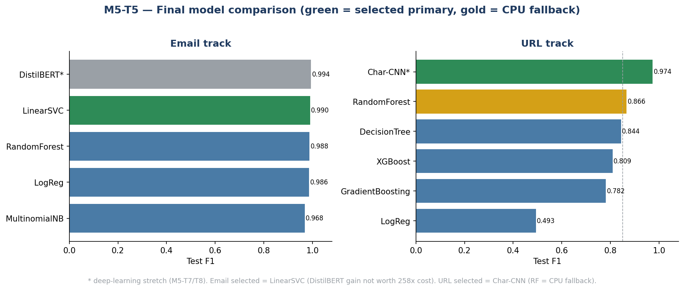

# M5-T5: Model Comparison Table & Primary Model Selection (Isaiah Campbell)

**Role:** Research & Data | **Depends on:** M5-T4 (consolidated benchmarks), M5-T2/T3 (classical), M5-T7/T8 (deep stretches)

> Consolidates every M5 benchmark into one comparison table and recommends a primary model
> **per track**, weighing accuracy, speed, and complexity. All numbers are on the held-out test
> split, produced through the shared M5-T1 harness (deep models log the same metric set; they
> skip the classical 5-fold CV).

## Comparison table — Email track

| Model | Accuracy | Precision | Recall | F1 | ROC-AUC | Train time | Type / notes |
| --- | --- | --- | --- | --- | --- | --- | --- |
| DistilBERT (fine-tuned) | 0.9939 | 0.9944 | 0.9939 | **0.9942** | 0.9997 | ~10,830 s (GPU) | Deep stretch (M5-T7) |
| **LinearSVC ✅** | 0.9898 | 0.9886 | 0.9919 | **0.9903** | 0.9991 | **~42 s (CPU)** | **Selected** — classical |
| RandomForest | 0.9871 | 0.9864 | 0.9890 | 0.9877 | 0.9989 | ~137 s | Classical |
| LogReg | 0.9852 | 0.9828 | 0.9889 | 0.9859 | 0.9987 | ~46 s | Classical |
| MultinomialNB | 0.9675 | 0.9868 | 0.9504 | 0.9683 | 0.9973 | ~42 s | Classical, TF-IDF only |

## Comparison table — URL track

| Model | Accuracy | Precision | Recall | F1 | ROC-AUC | Train time | Type / notes |
| --- | --- | --- | --- | --- | --- | --- | --- |
| **Char-CNN (raw URLs) ✅** | 0.9826 | 0.9709 | 0.9770 | **0.9739** | 0.9976 | ~642 s (GPU) | **Selected** — deep (M5-T8) |
| RandomForest | 0.9119 | 0.8755 | 0.8567 | 0.8660 | 0.9648 | ~96 s (CPU) | CPU fallback — classical |
| DecisionTree | 0.8968 | 0.8490 | 0.8386 | 0.8438 | 0.9365 | ~3 s | Classical |
| XGBoost | 0.8777 | 0.8410 | 0.7794 | 0.8090 | 0.9392 | ~9 s | Classical |
| GradientBoosting | 0.8620 | 0.8236 | 0.7440 | 0.7818 | 0.9236 | ~143 s | Classical |
| LogReg | 0.7463 | 0.7332 | 0.3718 | 0.4934 | 0.7837 | ~3 s | Linear — fails (non-linear problem) |

**Figure. Final model comparison** (green = selected primary, gold = CPU fallback).

## Primary model selection

### Email track → **LinearSVC** (F1 = 0.9903, ROC-AUC = 0.9991)
DistilBERT scores marginally higher (F1 0.9942, +0.0039) but costs ~258× the training time
(~3 h GPU vs ~42 s CPU) and adds transformer inference overhead in production — not justified for
a 0.4 % gain. LinearSVC is the best **accuracy-per-cost** choice: near-top F1, fastest of the
strong models, CPU-only, simple, and explainable. It also clears the deployment target comfortably.

### URL track → **Char-CNN** (F1 = 0.9739, ROC-AUC = 0.9976), Random Forest as CPU fallback
Here the deep model earns its place: Char-CNN beats the best classical model (Random Forest,
F1 0.866) by **+0.108 F1** at a modest cost (~11 min GPU). Learning from raw URL characters
captures obfuscation patterns the 11 engineered features miss. The trade-off is deployment
complexity (GPU/char-encoding pipeline), so **Random Forest is retained as the CPU fallback** —
it still clears the F1 ≥ 0.85 acceptance target (0.866) for environments without a GPU.

## Selection summary

| Track | Primary model | F1 | Why |
| --- | --- | --- | --- |
| Email | **LinearSVC** | 0.9903 | Near-best accuracy, 42 s CPU, simple; transformer gain not worth the cost |
| URL | **Char-CNN** | 0.9739 | +0.108 F1 over best classical at modest cost; RF (0.866) as CPU fallback |

## Notes for the team
- The two tracks reach **opposite verdicts on deep learning** — it pays off for raw URLs (weak
  engineered features) but not for TF-IDF email (a cheap linear model already saturates the task).
- Both primaries clear the acceptance targets; the URL fallback (RF) does too.
- Next: M5-T6 presents these to the team for final confirmation; M6 trains the chosen models.
