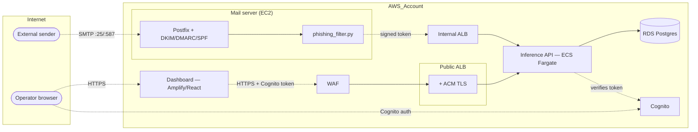

# Threat Model (STRIDE)

This threat model covers the Email Security Pipeline at the level expected for the Milestone 9 deliverable (M9-T3, PRD S-06). It is not an exhaustive enterprise threat model, but it does identify the most relevant risks and mitigations, and traces every Must control to the task that implements it.

**Last synced to the as-built architecture:** 2026-08-04, after M9-T0/T1/T2/T4/T5 landed. Earlier versions of this doc described a single "CentOS VM" hosting everything — that was the original design sketch, not what shipped. The system is actually split across a Rocky Linux mail EC2 instance, ECS Fargate (inference API), RDS Postgres, Cognito, and an Amplify-hosted React dashboard; the diagram and tables below reflect that.

## 1. Assets

| Asset | Description | Sensitivity |
|---|---|---|
| Inbound email content | Headers, bodies, URLs, attachments (mail server + uploaded/pasted via dashboard) | Confidential |
| Detection records | Score, verdict, feature snapshots, submitter identity — RDS `detections` table | Confidential |
| ML model artifacts | Trained model files (email LinearSVC, URL RF/Char-CNN) | Internal |
| Operator credentials | Cognito dashboard login (access/id/refresh tokens) | Confidential |
| Milter→API signing key | Static pre-shared key authenticating the mail filter to the inference API | Critical |
| Mail server (EC2) | Postfix + Dovecot + phishing content filter | Critical |
| Inference API (ECS Fargate) | FastAPI service serving both detection tracks | Critical |
| RDS Postgres | Detection records, behind private subnets | Critical |
| CloudTrail / Config / WAF logs | Account activity + findings, dedicated S3 bucket | Internal |

## 2. Trust Boundaries

Trust boundaries:
- Internet → Postfix (SMTP, receive-only on :25; authenticated submission on :587)
- Internet → WAF → Public ALB → Inference API (dashboard traffic + direct API callers)
- Mail server → Internal ALB → Inference API (server-to-server, signed static token, not internet-routable)
- Operator browser → Cognito (auth) and → Amplify (static assets) — separate services, both internet-facing
- Inference API → RDS (private subnets only, security-group restricted)

## 3. STRIDE Analysis

| Threat | Category | Likelihood | Impact | Mitigation | Implementing task |
|---|---|---|---|---|---|
| Spoofed sender bypasses detection | Spoofing | High | Medium | Inbound SPF/DKIM/DMARC validated (opendkim/opendmarc/policyd-spf) and annotated as `Received-SPF`/`Authentication-Results`, feeding the `has_spf`/`has_dkim` ML features; outbound mail signed via SES DKIM+SPF+DMARC | **M9-T0** (inbound), **M7-T6** (outbound). Verified end-to-end nightly: `dast-nightly.yml`'s `mail-relay-test` checks a real delivered message carries both headers, not just that Terraform declares the daemons (**M9-T5**) |
| Unauthenticated calls to the inference API | Spoofing / Elevation of Privilege | High | High | Every sensitive route requires either the milter's static signed token or a verified Cognito access token (`require_auth`); `JWT_SIGNING_KEY` is always injected in the deployed ECS task, so the "stays open" local-dev fallback never applies there | **M9-T1** |
| Attacker tampers with email body in transit | Tampering | Low | Medium | TLS on inbound SMTP (`smtpd_tls_security_level = may`) with a real Let's Encrypt cert; DKIM verification catches signed-mail tampering | **M7-T17** (cert), **M9-T0** (verification). `testssl.sh` scans the mail submission/IMAPS listeners nightly (**M9-T5**) |
| Attacker tampers with model artifact in S3 | Tampering | Low | High | S3 versioning, KMS encryption, account-wide public-access block; ECS task IAM role scoped read-only to the specific models bucket | M6-T7 (artifact registry), SEC-T3 |
| Operator denies they took an action on a flagged email | Repudiation | Low | Low | Detection rows are attributed by the caller's *verified* identity (`derive_provenance`), not a client-supplied field — a Cognito analyst's `sub`/`username` claim, or `source=server` for the mail path. This was tightened specifically because a client-supplied `source`/`submitted_by` let any authenticated caller (or a fuzzer with a token) write into the wrong feed under any name | M7-T13 |
| Detection logs leak email metadata | Information Disclosure | Medium | Medium | RDS encrypted at rest (KMS) and in transit (TLS), private-subnet + security-group isolated, IAM DB auth enabled. Raw email body/attachment content was never stored in the first place (verified against the schema — only subject, addresses, extracted URLs, and 5 numeric features). 180-day retention policy purges the metadata that *is* stored (subject, addresses) via a daily scheduled task | Encryption/isolation: M7 infra. Retention: **M9-T7** (`docs/data-retention-privacy.md`, `retention_purge.py` + `aws_scheduler_schedule.retention_purge`) |
| Inference service is overwhelmed by very large or many emails | Denial of Service | Medium | Medium | 2MB request body cap (`MAX_EMAIL_BYTES`), milter request timeout (45s) with fail-open re-injection, circuit breaker on repeated API failures | Body cap/circuit breaker: M7-T16. **No rate-limiting WAF rule configured** — the M9-T4 WAF only has the three AWS managed content-inspection rule groups, no rate-based rule — residual gap |
| Open relay allows spam to be sent through us | Elevation of Privilege | Medium | High | Port 25 receive-only (`reject_unauth_destination`); relay only via authenticated submission on :587 (`permit_sasl_authenticated,reject`) | **M9-T2**. Verified nightly, not just at config-review time: `mail-relay-test` actively attempts an unauthenticated relay and asserts `554 5.7.1` (**M9-T5**) |
| Attacker pivots from dashboard/API to host shell | Elevation of Privilege | Low | Critical | No shell endpoints; API runs as non-root `appuser` in an ECS Fargate task (no persistent host, no SSH surface); least-privilege task IAM role | M7-T7 (containerize + deploy) |
| XSS via attacker-controlled email content rendered in the dashboard | Tampering / Information Disclosure | Medium | High | React's default JSX escaping for rendered detection fields (subject, sender, etc.); authenticated ZAP scan of the dashboard specifically to catch DOM-XSS sinks and `dangerouslySetInnerHTML` misuse this class of content is most likely to hit | **M9-T5** (`zap-dashboard-auth.yml`, on-demand — not yet run as a scheduled gate, see §4) |
| Public ALB attacked directly (injection, known-bad payloads, malicious IPs) | Tampering / Elevation of Privilege | Medium | High | WAFv2 with AWS managed Common/KnownBadInputs (incl. Log4Shell)/IP-reputation rule groups | **M9-T4**. Currently in **COUNT mode** (observe-only) pending a baseline run confirming no false positives — not yet actually blocking |
| ML model evasion via adversarial features | Tampering | Medium | Medium | Periodic retraining; monitor score distribution drift | No task owns this yet — residual risk, process not tooling |
| Sensitive secrets pushed to public repo | Information Disclosure | Medium | High | GitHub native secret scanning (push protection); runtime secrets in Secrets Manager, never committed | SEC-T3. **gitleaks (full git-history scan) not yet implemented** — devsecops.md §3.2 flags this as a real gap versus intent |
| AWS account compromise / no centralized threat detection | Information Disclosure / Elevation of Privilege | Low | Critical | CloudTrail (multi-region, S3 + CloudWatch Logs), AWS Config baseline, CloudWatch alarms (ALB 5xx/latency, RDS CPU/connections) via a shared SNS topic | **M9-T4**. **GuardDuty and Security Hub are confirmed permanently unavailable** on this AWS account — `SubscriptionRequiredException` reproduced directly against the account with `AdministratorAccess` credentials, an account-subscription block common on education/credit AWS accounts, not an IAM or Terraform gap (docs/devsecops.md §6) |

## 4. Controls Checklist

- [x] Postfix relay restrictions enforced (`smtpd_relay_restrictions`) — **M9-T2**, verified nightly by **M9-T5**
- [x] TLS enabled on inbound SMTP with a real (Let's Encrypt) certificate — **M7-T17**
- [x] SPF, DKIM, and DMARC checked on inbound mail, annotated for the ML pipeline — **M9-T0**
- [x] Inference API requires auth on every sensitive route (static signed token or Cognito) — **M9-T1**
- [x] Dashboard requires Cognito login, served via HTTPS (Amplify) — **M9-T1**
- [x] RDS encrypted at rest (KMS) + in transit, network-isolated, IAM DB auth — M7 infra
- [x] Secrets via Secrets Manager, never committed — SEC-T3
- [x] Dependencies audited (`pip-audit`, `npm audit`) on every PR — devsecops.md §3.2
- [x] WAF managed rule sets on the public ALB — **M9-T4** (COUNT mode, not yet blocking — see §3)
- [x] CloudTrail + AWS Config baseline — **M9-T4**
- [x] CloudWatch alarms on ALB/RDS health — **M9-T4**
- [x] Mail relay/spoof and TLS posture checked automatically, not just manually — **M9-T5**
- [x] Detection log retention policy defined and enforced (180 days, daily scheduled purge) — **M9-T7** (`docs/data-retention-privacy.md`)
- [x] Documented security decisions & compliance posture, consolidated in one place — **M9-T6** (`docs/security-decisions.md`)
- [ ] GuardDuty + Security Hub — **permanently blocked on this AWS account** (§3, devsecops.md §6), not a pending item
- [ ] WAF flipped from COUNT to actually blocking — pending a baseline run with no false positives
- [ ] Rate-limiting on the public ALB/WAF — not configured, residual DoS gap
- [ ] gitleaks (full-history secret scan) — devsecops.md §3.2 gap, not yet implemented
- [ ] OS packages on the mail EC2 patched on an ongoing cadence — `package_update`/`package_upgrade` run once at boot (cloud-init), no `dnf-automatic` or equivalent afterward
- [ ] **This document reviewed by the team** — M9-T3's own acceptance criterion; pending as of this sync

## 5. Compliance Notes (Current Scope)

For now, we treat compliance as a documentation exercise:
- We do not handle regulated personal data of real users.
- We acknowledge that a production deployment would need to consider GDPR / PIPEDA / sector-specific requirements before processing real user mail — see `docs/data-retention-privacy.md` (M9-T7) for what's implemented (a 180-day metadata purge) versus what a real deployment would still need (legal basis review, subject access/deletion requests, breach notification).
- Datasets used are publicly available and used for academic purposes only.

## 6. Residual Risks

- Adversarial phishing crafted specifically against our model is hard to fully eliminate; no task currently owns ongoing retraining/drift monitoring.
- Retention (M9-T7) covers only the `detections` table (subject/addresses/metadata, never the raw body). Mailbox content on the mail server itself has no retention policy, and purged `detections` rows persist in RDS's 7-day automated backups until those age out — a real data-subject deletion request isn't fully honored by the scheduled purge alone.
- GuardDuty/Security Hub cannot run on this AWS account tier — CloudTrail/Config/CloudWatch alarms cover the same ground manually (someone has to look), but there's no automated threat-detection layer.
- WAF is observe-only (COUNT mode); a real attack today would be logged but not blocked until it's flipped to block mode.
- No rate-limiting exists at the WAF/ALB layer — a volumetric attack against the public API is bounded only by the 2MB body cap and normal AWS infrastructure limits, not an explicit control.
