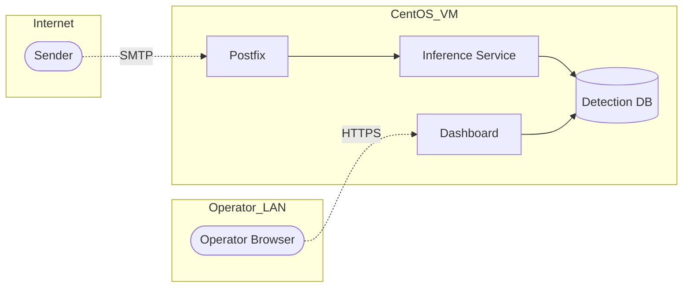

# Threat Model (STRIDE)

This threat model covers the Email Security Pipeline at the level expected for the CYT300 capstone Milestone 9 deliverable. It is not an exhaustive enterprise threat model, but it does identify the most relevant risks and mitigations.

## 1. Assets

| Asset | Description | Sensitivity |
|---|---|---|
| Inbound email content | Headers, bodies, URLs, attachments | Confidential |
| Detection records | Score, verdict, feature snapshots | Confidential |
| ML model artifact | Trained model file | Internal |
| Operator credentials | Dashboard login | Confidential |
| CentOS VM | Hosts mail and ML services | Critical |

## 2. Trust Boundaries

Trust boundaries:
- Internet → Postfix
- Operator browser → Dashboard
- Inter-process within VM (lower trust risk but still in scope)

## 3. STRIDE Analysis

| Threat | Category | Likelihood | Impact | Mitigation |
|---|---|---|---|---|
| Spoofed sender bypasses detection | Spoofing | High | Medium | Validate SPF/DKIM/DMARC; include result as feature |
| Attacker tampers with email body in transit | Tampering | Low | Medium | Enforce TLS on inbound SMTP where possible; enforce DKIM verification |
| Attacker tampers with model artifact on disk | Tampering | Low | High | File integrity monitoring; restrict write permissions to deploy user |
| Operator denies they took an action on a flagged email | Repudiation | Low | Low | Audit log of dashboard actions with user + timestamp |
| Detection logs leak email contents | Information Disclosure | Medium | High | Truncate or hash sensitive content; restrict DB access; retention policy |
| Inference service is overwhelmed by very large emails | Denial of Service | Medium | Medium | Body size limits, request timeout, fail-open in milter |
| Open relay allows spam to be sent through us | Elevation of Privilege | Medium | High | Restrict relay; require auth for outbound; default config review |
| Attacker pivots from dashboard to OS shell | Elevation of Privilege | Low | Critical | No shell endpoints; principle of least privilege; non-root services |
| ML model evasion via adversarial features | Tampering | Medium | Medium | Periodic retraining; monitor score distribution drift |
| Sensitive secrets pushed to public repo | Information Disclosure | Medium | High | `.env` ignored in git; pre-commit secret scanner |

## 4. Controls Checklist

- [ ] Postfix relay restrictions enforced (`smtpd_relay_restrictions`)
- [ ] TLS enabled on inbound SMTP (`smtpd_tls_security_level = may`)
- [ ] SPF, DKIM, and DMARC checks in path
- [ ] Inference service bound to `127.0.0.1`
- [ ] Dashboard served via HTTPS with auth
- [ ] DB file permissions `600`, owned by service user
- [ ] Logs rotate and scrub bodies after configured retention
- [ ] Secrets via environment, not committed
- [ ] Dependencies pinned and audited (`pip-audit`)
- [ ] OS packages patched on a known cadence

## 5. Compliance Notes (Capstone Scope)

For the capstone, we treat compliance as a documentation exercise:
- We do not handle regulated personal data of real users.
- We acknowledge that a production deployment would need to consider GDPR / PIPEDA / sector-specific requirements before processing real user mail.
- Datasets used are publicly available and used for academic purposes only.

## 6. Residual Risks

- Adversarial phishing crafted specifically against our model is hard to fully eliminate.
- A misconfigured Postfix could become an open relay; mitigated by checklist + automated config tests.
- Long retention of detection logs increases blast radius if the DB is leaked; mitigated by policy and access controls.
